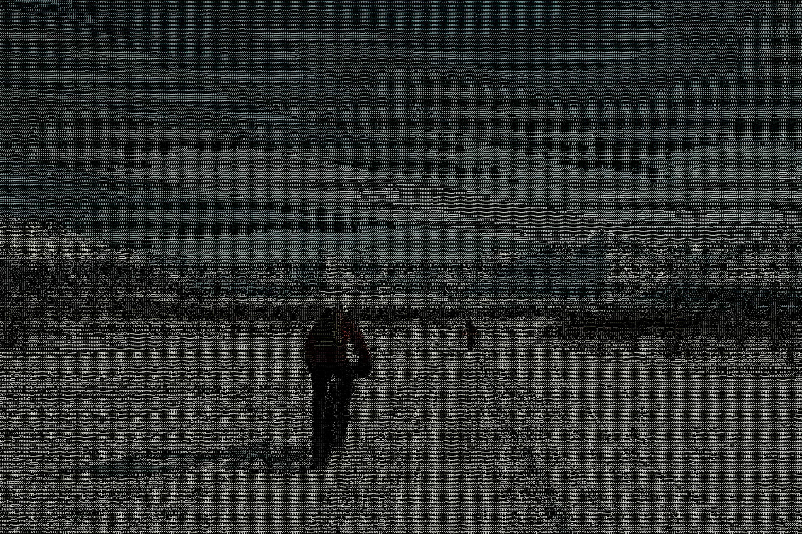

# Cześć, jestem Kamil! 👋

### 🚀 Full-Stack, Data Science & Embedded Systems Engineer

Jestem inżynierem o wszechstronnych kompetencjach, łączącym świat zaawansowanej analizy danych, systemów mobilnych, nowoczesnego web-devu oraz niskopoziomowego oprogramowania sprzętowego (Bare-Metal). Projektuję systemy zorientowane na wysoką wydajność, bezpieczeństwo danych i automatyzację.

> ⏱️ *Uwaga: Niektóre z poniższych aplikacji webowych są hostowane na darmowych instancjach Render – ich pierwsze uruchomienie po dłuższej nieaktywności może zająć kilkanaście sekund (wybudzanie serwera).*

---

## 🛠️ Moja Skrzynka z Narzędziami (Tech Stack)

| Obszar | Technologie i Narzędzia |
| :--- | :--- |
| **Języki Programowania** |       |
| **Data Science & Computer Vision** |     |
| **Backend & WebSockets** |     WebRTC |
| **Mobile & Cybersec** |  Szyfrowanie Android Keystore & Biometria |
| **Cloud & DevOps** |     |
| **Hardware & Embedded** | ARM Cortex-M (Kinetis/STM32) • Keil uVision • CMSIS • Bare-Metal (Rejestry) • I2C • ADC • SPI |

---

## 🌟 Wyróżnione Projekty (Top Projects)

### 🔗 Skylink P2P
**Aplikacja webowa do błyskawicznego, bezpośredniego przesyłania plików między przeglądarkami w architekturze peer-to-peer.**
* **Technologie:** Node.js, Express, Socket.io, WebRTC, Hosting Render.
* **Kluczowe funkcje:** Przesyłanie danych bez udziału centralnego serwera przechowującego pliki. Obsługuje nie tylko bezpośrednie transfery 1-do-1, ale również bezpieczną architekturę multi-cast umożliwiającą jednoczesne rozsyłanie pakietów danych w sieciach lokalnych skupiających do 3-4 użytkowników jednocześnie.
* 🚀 **Przetestuj wersję Live:** [skylinkk-p2p.onrender.com](https://skylinkk-p2p.onrender.com/)

### 🔐 Secret Manager
**Innowacyjna aplikacja bezpieczeństwa na Androida, pełniąca rolę generatora haseł i "Cyfrowego Testamentu", zakamuflowana jako w pełni funkcjonalny kalkulator.**
* **Technologie:** Flutter, Dart, Android Keystore (`FlutterSecureStorage`), lokalna autoryzacja biometryczna.
* **Kluczowe funkcje:** Bezszyfrowy portfel haseł generujący unikalne klucze w locie za pomocą **HMAC-SHA256** (brak przechowywania haseł w bazie), mechanizm *Dead Man's Switch* (ujawnianie sekretu zaufanym osobom po braku aktywności przez X dni), synchronizacja czasu NTP (odporność na zmianę zegara systemowego) oraz asynchroniczne procesy powiadomień w tle.
* 🔗 [Przejdź do wersji Release](https://github.com/KrasKamil/SecretManager-Release)

### 🅿️ Parking Spot AI
**System wizji komputerowej do monitorowania zajętości miejsc parkingowych w czasie rzeczywistym z wbudowanym asystentem nawigacji.**
* **Technologie:** Python, OpenCV, NumPy, algorytm przeszukiwania grafów A*.
* **Kluczowe funkcje:** Autorski, sterowany kreator (wizard) konfiguracji nowego parkingu, wizualna kalibracja wymiarów miejsc za pomocą interfejsu OpenCV GUI, obsługa strumieni wideo, kamer IP i transmisji YouTube (`yt-dlp`), a także wyznaczanie najkrótszej i bezpiecznej ścieżki algorytmem **A\*** do najbliższego wolnego miejsca parkingowego.
* 🔗 [Przejdź do repozytorium](https://github.com/KrasKamil/Parking_spots_detection)

### 🎨 Advanced ASCII Art Generator (ASCII_gen)
**Zaawansowane narzędzie CLI do transformacji obrazów cyfrowych w unikalną sztukę ASCII Art.**
* **Technologie:** Python, Pillow, Requests, PyAutoGUI, tqdm, Unsplash API.
* **Kluczowe funkcje:** Konwersja obrazów z plików lokalnych, zewnętrznych adresów URL oraz dynamiczne pobieranie losowych fotografii wysokiej jakości poprzez API Unsplash. Oferuje precyzyjne mapowanie jasności pikseli na znaki (Character Mapping), generowanie wielokolorowego ASCII Art, automatyczny podgląd w przeglądarce oraz eksport wyników do plików tekstowych lub grafik PNG.
* 🔗 [Przejdź do repozytorium](https://github.com/KrasKamil/PythonProjects)

📸 <b>Otwórz porównanie efektu (Przed / Po)</b>

 

> ⚙️ *Notatka: Wygenerowana grafika wyjściowa (`mount.png`) została celowo przeskalowana w aplikacji przy użyciu parametru **Scale Factor**, aby zoptymalizować rozmiar pliku i zapewnić płynne ładowanie w przeglądarce.*

| 🖼️ Oryginalne zdjęcie | 👾 Wynik ASCII Art |
| :---: | :---: |
|  |  |

### 🌡️ Smart Thermo Assistant
**Zaawansowany system domowego asystenta i dashboardu multimedialnego zoptymalizowany pod kątem systemów Windows oraz Raspberry Pi.**
* **Technologie:** TypeScript (Backend Core), Node.js, Express, Python (WinSDK), HTML5/CSS3 (Glassmorphism UI), Chart.js.
* **Kluczowe funkcje:** Integracja z OAuth Spotify (pobieranie metadanych i sterowanie), systemowy skaner urządzeń Bluetooth do wykrywania obecności domowników, moduł monitorowania pogoda (OpenWeatherMap) oraz wbudowane REST API do integracji z powiadomieniami bota Telegram.
* 🔗 [Przejdź do repozytorium](https://github.com/KrasKamil/SmartThermo)

### 📊 Market Brain Station
**Profesjonalny bot do tradingu algorytmicznego z silnikiem wielostrategicznego backtestingu.**
* **Technologie:** Python 3.9+, DuckDB, yfinance, Pandas, NumPy, Telegram API.
* **Architektura:** Event-Driven, wzorce Repository Pattern i Unit of Work.
* **Kluczowe funkcje:** Monitorowanie ponad 176 aktywów finansowych, odporny silnik informacyjny z mechanizmem retry (Tenacity), filtr korelacji ryzyka sektorowego, automatyczne generowanie raportów HTML oraz interaktywny panel sterowania za pomocą bota Telegram z wykresami linii kapitału (Equity Curve).
* 🔗 [Przejdź do repozytorium](https://github.com/KrasKamil/market-brain-station)
---

## 🛠️ Pozostałe Projekty i Doświadczenie Techniczne

🌐 <b>Web Development & Systemy Czasu Rzeczywistego</b>

* **Party Game PoC (Fibbage Clone):** Wieloosobowa gra towarzyska czasu rzeczywistego inspirowana "Fibbage". Smartfony graczy służą jako interaktywne kontrolery do wprowadzania kreatywnych odpowiedzi i głosowania, zsynchronizowane za pomocą WebSockets z centralnym ekranem rozgrywki.
  * 🖥️ **Ekran główny (Host):** [fibbage-pl.onrender.com/host](https://fibbage-pl.onrender.com/host)
  * 📱 **Dołączenie gracza (Player):** [fibbage-pl.onrender.com](https://fibbage-pl.onrender.com/)
* **AKRA-animacje:** Wdrożona, w pełni produkcyjna strona internetowa stworzona dla mojej siostry, prezentująca autorską ofertę animacji. Projekt skupia się na estetycznym interfejsie użytkownika, wysokiej wydajności oraz pełnej responsywności (RWD).
  * 🌐 **Zobacz na żywo:** [akraanimacje.com](https://akraanimacje.com)
* **Oravski Hrad - Panel Zarządzania:** Pełnoekranowa aplikacja Full-Stack (Node.js, Express, Socket.IO) realizująca dwustronną komunikację WebSocket w czasie rzeczywistym. Obsługuje globalne ogłoszenia (broadcast) i wiadomości prywatne ("szepty") pomiędzy użytkownikami oraz interaktywną mapę SVG zamku.
* **Custom HLS Player:** Odtwarzacz wideo HTTP Live Streaming (.m3u8) zbudowany na bazie `hls.js`, wspierający adaptację bitrate, dynamiczne logowanie żądań manifestu oraz autorski moduł restrykcji geograficznych na bazie geolokalizacji IP.

☁️ <b>DevOps, Logistyka & Architektura Systemowa</b>

* **CourierSimulator:** Aplikacja symulacyjna dedykowana logistyce i wyznaczaniu tras kurierskich. Skupia się na implementacji struktur obiektowych oraz algorytmów optymalizacyjnych wspomagających efektywne zarządzanie dostawami i operacjami flotowymi.
* **Azure Global 2026 Kraków Workshop:** Kompletne wdrożenia bezpiecznych potoków CI/CD przy użyciu **GitHub Actions** oraz **Terraform**. Architektura oparta na bezhasłowej autoryzacji federacyjnej (OIDC/Federated Identity) pomiędzy GitHubem a platformą Azure, konteneryzacja aplikacji w Azure Container Registry (ACR) i zarządzanie infrastrukturą (IaC).
* **Railway Reservation System:** Kompaktowy system zarządzania rezerwacjami kolejowymi napisany w obiektowym C++, wykorzystujący pliki strukturyzowane JSON do zapisu danych, wzbogacony o pełną walidację wejścia i poprawne wsparcie dla kodowania polskich znaków.

🔌 <b>Embedded Systems (Systemy Wbudowane)</b>

* **Snake Game Bare-Metal (Cortex-M0+):** Klasyczna gra w węża napisana w języku C (standard C99) na mikrokontroler **FRDM-KL05Z (NXP Kinetis)**. Projekt zrealizowany bez bibliotek wysokopoziomowych (bare-metal) bezpośrednio na rejestrach CMSIS. Wykorzystuje I2C zrealizowane programowo (bit-banging) do komunikacji z wyświetlaczem LCD 16x2, przetwornik ADC do obsługi dwuosiowego joysticka analogowego oraz systemowy zegar przerwaniowy `SysTick`.

🧮 <b>Algorytmy, Narzędzia CLI & Automatyzacja</b>

* **Mean Shift Implementation from Scratch:** Implementacja nienadzorowanego algorytmu klasteryzacji Mean Shift napisana od zera w czystym **NumPy**. Wykorzystuje logikę płaskiego jądra jednostajnego (Flat Kernel), moduł automatycznego scalania zbiegających się środków skupień (Centroid Pruning) i pełną zgodność z interfejsem API `scikit-learn` (`fit`/`predict`), zweryfikowaną testami w `pytest`.
* **cv-gen (CLI CV Builder):** Narzędzie wiersza poleceń Node.js wykorzystujące bezgłową przeglądarkę **Puppeteer (Chromium)** do automatycznego generowania nowoczesnych i czytelnych dla systemów rekrutacyjnych (ATS-friendly) dokumentów CV w formacie PDF z plików strukturyzowanych JSON.

---

---
📫 **Jak się ze mną skontaktować?** [Mój Profil na GitHubie](https://github.com/KrasKamil)
